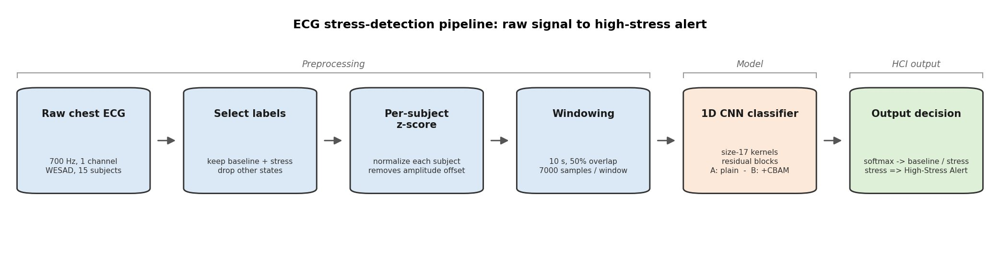
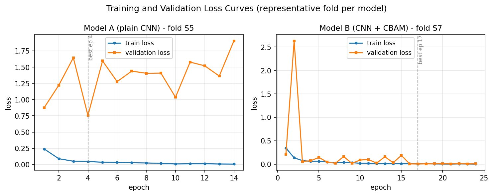
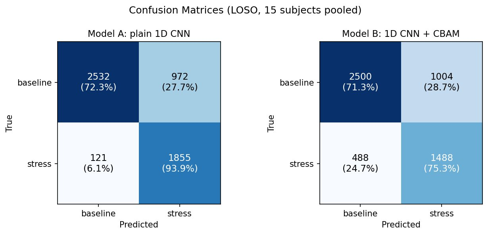

# ECG Stress Detection with Deep Learning

Detecting stress from raw ECG (heart) signals using deep learning, and testing whether an attention mechanism (CBAM) actually improves it — evaluated honestly on subjects the model has never seen.

This was a university course project (Human-Computer Interaction, ECE5608) at the Arab Academy for Science, Technology and Maritime Transport (AASTMT), completed by a team of four.

---

## Overview

**What it does:** The system reads a raw chest ECG signal and classifies each short window as **calm (baseline)** or **stressed** — the core of a real-time "high-stress alert" concept for surgeons, whose hands and eyes are occupied during operations and cannot give manual input.

**Why:** Under heavy stress, a surgeon's attention can narrow ("cognitive tunneling") and they may miss important cues. ECG reflects stress involuntarily, so it can be monitored passively without interrupting the surgeon.

**The main question:** A reviewed research paper suggested that adding a CBAM **attention** block to a CNN improves ECG classification. We tested this fairly by building the **same network with and without CBAM** and comparing them under strict, subject-independent evaluation.

---

## Key Features

- Full pipeline from **raw ECG** to a calm/stress decision — no hand-crafted features.
- **Per-subject normalization** so the model learns the heartbeat shape, not a person's signal amplitude.
- **Two models compared:** a 1D CNN, and the same CNN plus a CBAM attention block.
- **Leave-One-Subject-Out (LOSO)** cross-validation — every result is on a person the model never trained on (the honest way to measure generalization).
- **Multi-metric, per-class evaluation** (balanced accuracy, precision, recall, F1, confusion matrices) — not just accuracy.
- **Inference latency measured** (~4 ms per window) to confirm it is fast enough for real-time use.
- Works with **sensitive physiological (health) data**, handled with subject privacy in mind.

---

## Results

Evaluated with Leave-One-Subject-Out cross-validation on 15 subjects from the WESAD dataset.

| Metric | Model A (plain CNN) | Model B (CNN + CBAM) |
|---|---|---|
| Balanced accuracy | **0.829** | 0.729 |
| Stress recall | **93.9%** | 75.3% |
| Missed-stress windows | **121** | 488 |

**Finding:** The **simpler CNN performed better** — higher accuracy and, importantly, it missed far less stress (missing stress is the dangerous error for a safety alert). Adding CBAM did *not* help on this dataset, likely because the ECG signal was already clean and 15 subjects is limited data for an attention module to learn from. An honest negative result: **more complexity was not an improvement here.**

### System Pipeline


### Training and Validation Curves


### Confusion Matrices


---

## Tech Stack

- **Python**, **Jupyter Notebook**
- **PyTorch** (deep learning — 1D CNN and CBAM)
- **NumPy**, **scikit-learn** (data handling and evaluation metrics)
- **Matplotlib** (figures)
- **LaTeX** (IEEE report)

---

## Dataset

This project uses the **WESAD** (Wearable Stress and Affect Detection) dataset. It is **not included** in this repository (it is large and belongs to its authors). You can download it here:
https://archive.ics.uci.edu/dataset/465/wesad

---

## How to Run

1. Download the WESAD dataset from the link above and unzip it.
2. Open `Python/HCI_proj.ipynb` in Jupyter Notebook.
3. In the first cell, set the dataset path to your WESAD folder:
```python
   WESAD_DIR = r"PATH\TO\WESAD"
```
4. Run the cells in order. A CUDA-capable GPU is recommended but not required; batch size and window size can be lowered if memory is limited.

---

## Repository Structure
